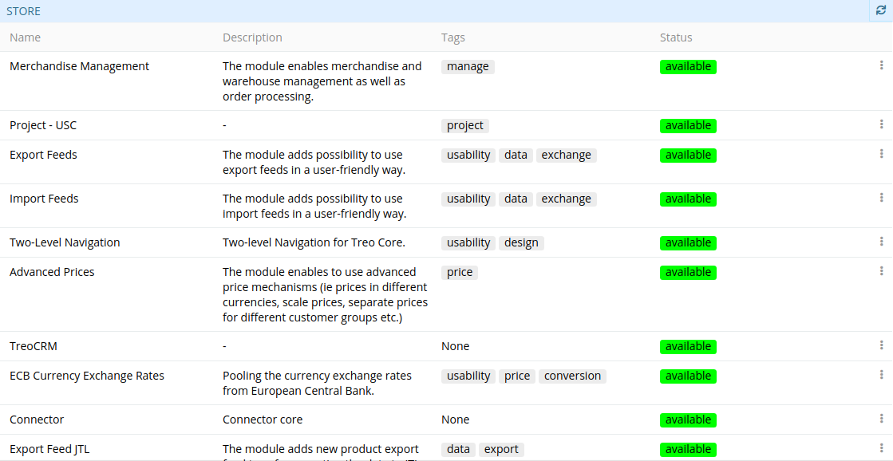
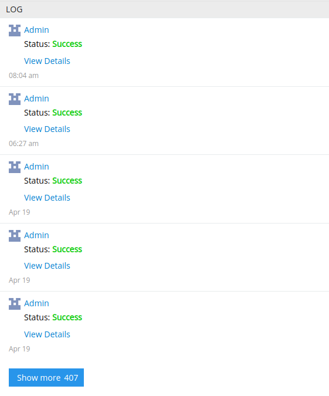
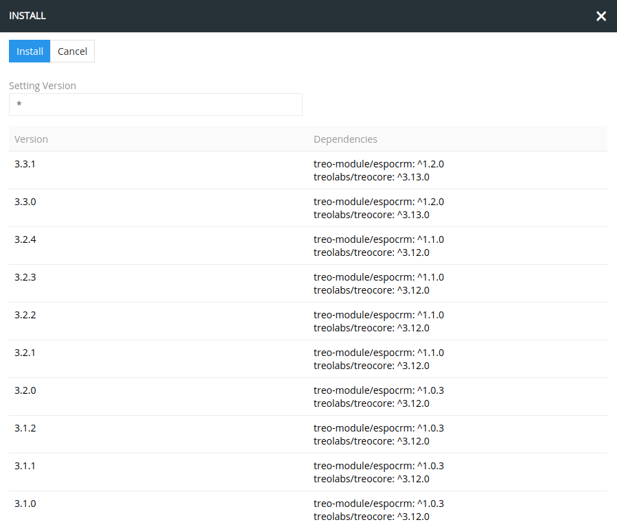

## Module manager

To installation, updating, and removing modules in TreoCore provide a module manager mechanism. Within TreoCore, modules – extensions that add new or expand existing functionality.

Module Manager is located in Administration > Modules page.

As you can see, module manager consist of three parts:

* Install panel – display list of installed modules in system. There is you can get information such as module description, setting version (* means newest version), current version in TreoCore and required dependencies in corresponding column.

  
  
* Store panel – list of all modules that support TreoCore. As Install panel in has description of each module. Tags identify module by it features that simplifies search of needed modules, for example: possibility export or restore data, price managing, etc. Status column points on possibility of module managing. More in [module buying](#module-buying).   

  

* Logs – display actions history in Module manager by every system user.

  
  
  Clicked to view detail you get information about operation with packages and their dependencies.
  
  

#### Module buying

First, visit our store for details: [English version](https://treopim.com/store), [German version](https://treopim.com/de/shop).

In TreoStore modules has one of two statuses:

* **available** – available for installation;
* **buyable** – there is no access to module.

To change status from **buyable** to **available** after confirmation of module purchase you must take contact with our support and tell your system ID, that contain on the Administration > Settings page. In case of success after several minutes needed module will be available in TreoStore.
    

#### Module installing

Before installing, make sure that the module has status **available**. More details in [module buying](#module-buying).

To install module:

1. Go to Administration > Modules.
2. Open dropdown menu in needed module.

   
3. Click Install button.

   
4. Choose version to install. You can set module version manually or set * for newest version.

   
   
   After you click Install TreoCore generate schema with chosen modules and their dependencies for further installation.

5. To start modules install process click Run Update and confirm action. 
   
   

   During the updating you can call realtime logs to get actual information about process.
   
   

#### Module updating

To update module version:

1. Go to Administration > Modules.
2. Open dropdown menu from Installed panel.
3. Click Update button.
4. Choose version to update.
5. Click Run Update.

#### Module deleting

To delete module from system:

1. Go to Administration > Module Manager.
2. Open dropdown menu from Installed panel.
3. Click Delete button.
4. Click Run Update.