# User Interface (UI)

The user interface (UI) includes all visible elements users see and interact with while using KennerCore. This article contains the overview of all the main elements of user interface, which are the same for all entities in the system, as well as gives details on how to perform common tasks or operations in the system.

> Please, make sure to contact your administrator in order to have access to a whole set of options described in this user guide.

The following elements make up the KennerCore user interface:

- [**Navigation Menu**](#navigation-menu) – to navigate through available entities.
- [**Taskbar**](#taskbar) – to help the user interact with the KennerCore system in a more efficient way; additional information or actions are displayed here. 
- [**Search and Filtering Panel**](./search-and-filtering-core.md) – to search and filter within one entity or its related entities.

Within the KennerCore system your information may be presented in various ways:

- [**List View**](./views-and-panels-core.md#list-view) – to view the lists of entity records.
- [**Detail View**](./views-and-panels-core.md#detail-view) – to view the entity record details.
- [**Create View**](./views-and-panels-core.md#create-view) – to create a new entity record in the main window.
- [**Edit View**](./views-and-panels-core.md#edit-view) – to edit the entity record.
- [**Quick Detail View (pop-up)**](./views-and-panels-core.md#quick-detail-view-small-detail-view) – to view the record details in the pop-up window.
- [**Quick Edit View (pop-up)**](./views-and-panels-core.md#quick-edit-view) – to edit the record detail in the pop-up window.
- [**Quick Create View**](./views-and-panels-core.md#quick-create-view) – to create a new entity record in the pop-up window.

## Navigation Menu

The navigation menu in the default KennerCore theme is the menu placed on the left side of your user interface. It allows you to open list views for all entities in the system.

> The navigation menu can be configured by your administrator according to your needs.

Each user can customize his/her own navigation menu in the `User Interface` section of the user ["Preferences"](#user-preferences) page:

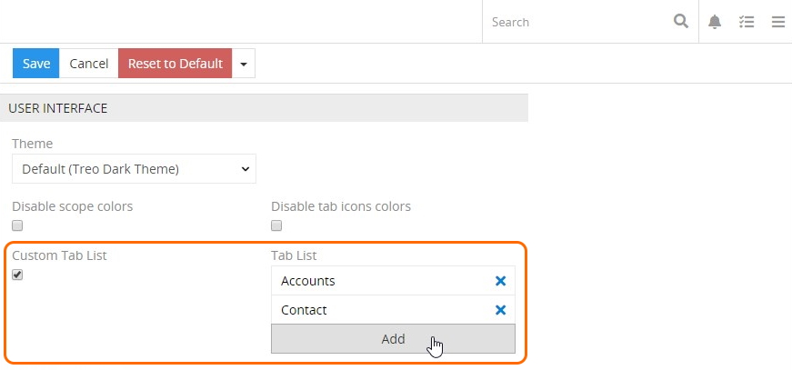

Here select the `Custom Tab List` option and add the desired tabs using the `Add` button. You can also define the tabs order via their drag-and-drop in the tab list.

## Taskbar

Taskbar is a top panel of the KennerCore user interface:

A taskbar consists of a [global search](#global-search) field and some functional icons that help you work and collaborate within the TreoPIM system, namely:
- [Desktop notifications](#desktop-notifications); 
- [Queue Manager](#queue-manager);
- [Quick create](#quick-create);
- [User menu](#user-menu).

### Global Search

You can [search](./search-and-filtering-core.md) all the records existing in the KennerCore system using the global search functionality. Use the search form on the taskbar for it:

> The list of entities available for search is configured by the administrator.

### Desktop Notifications

KennerCore uses two types of notifications: email notifications and system notifications (desktop notifications). Generally, email and desktop notifications are configured globally, for all users.

User can receive notifications in case when:

- a record is assigned to him;
- changes are made to the record he is following.

To view the notification details, click `View List` in the upper right corner of the `NOTIFICATIONS` panel.

### Queue Manager

Queue Manager is opened in the pop-up window for each operation executed displaying its status and a progress circle for the currently run operation:

In the Queue Manager pop-up, the most recent KennerCore operations, which were executed in the background mode, are displayed. Additionally, the information on the data import performed with the help of import feeds is shown in the Queue Manager pop-up. To learn more about the ["Import Feeds"](https://treopim.com/store/import-feeds) module, please, visit our store.

To view the details of the performed operations, click `View List` in the upper right corner of the Queue Manager.

### Quick Create

To create new records from anywhere, click the quick create button located in the upper right corner of the taskbar on any KennerCore page and choose the entity for the record to be created:

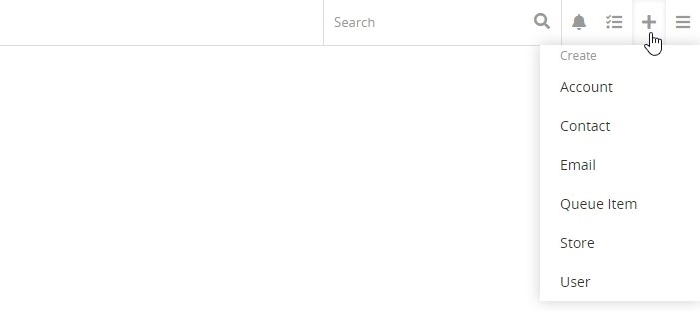

The [quick create view](./views-and-panels-core.md#quick-create-view) page will be opened.

> If there is no quick create button on your taskbar, please, contact your administrator.

## User Menu

Click the hamburger icon in the upper right corner of the user interface to open the user menu:

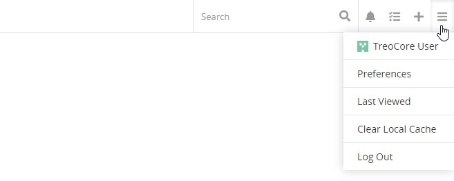

### User Account

There are many configuration options available to users once logged into the system. They can be viewed and managed on the [user profile](#user-profile) and [preferences](#user-preferences) pages.

#### User Profile

Click your username to open your user **user profile** page:

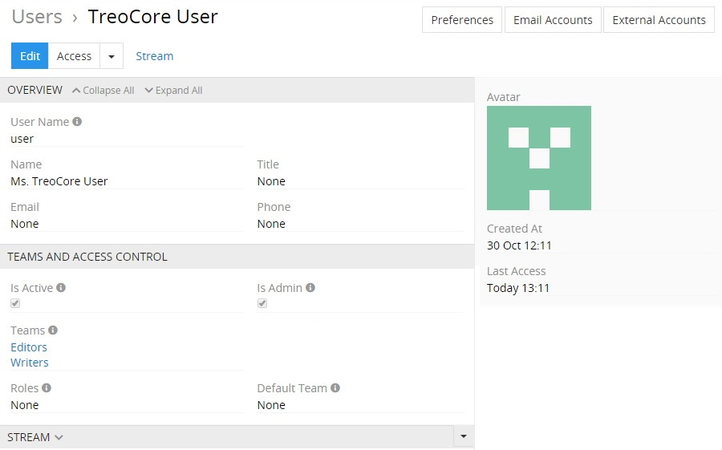

The current user personal data is given on the `OVERVIEW` panel, while teams and roles details are displayed on the `TEAMS AND ACCESS CONTROL` panel.

Click the `Edit` button to make changes on these two panels in the editing page that opens:

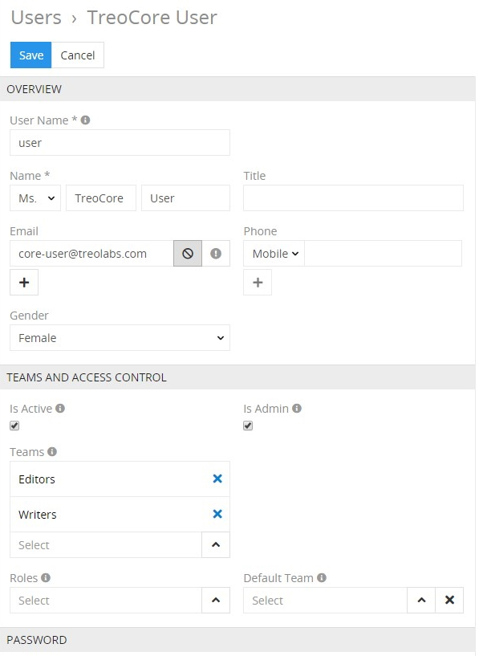 

Click the `Save` button to apply the changes or `Cancel` to abort them.

> If there is no `Edit` button on your user profile page, please, contact the administrator.

On the user profile page, click the `Access` button to view your current permissions within the KennerCore system on the scope and field levels in the pop-up window that appears:

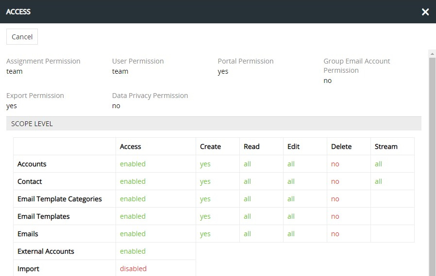

> Access rights are modified by the administrator only.

Click the actions button to see the list of actions available for the currently open entity:

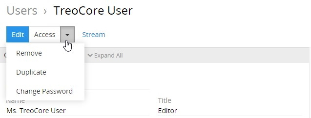

> If there are less options in your actions menu, please, contact the administrator.

To remove the current user, click the `Remove` option and confirm your decision in the pop-up that appears. Use the `Duplicate` option from the same menu to go to the user creation page and get all the values of your current user record copied in the empty fields of the new user record to be created. 

To change your user password, select the corresponding option in the actions drop-down menu and complete the operation on the "Change Password" page:

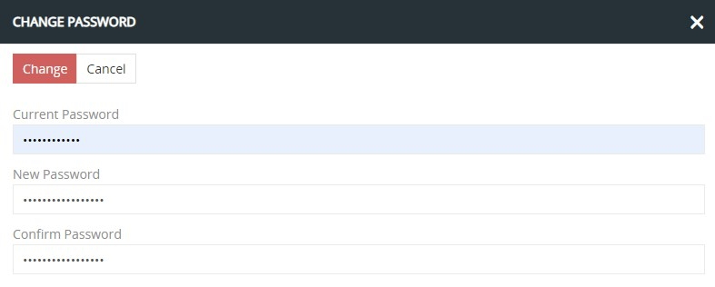

If you forget your password, it can be recovered using the `Forgot Password?` link on the KennerCore login page.

You can also manage your team and access control, if you have the corresponding permissions.

At the bottom of the screen you will see your personal activity stream:

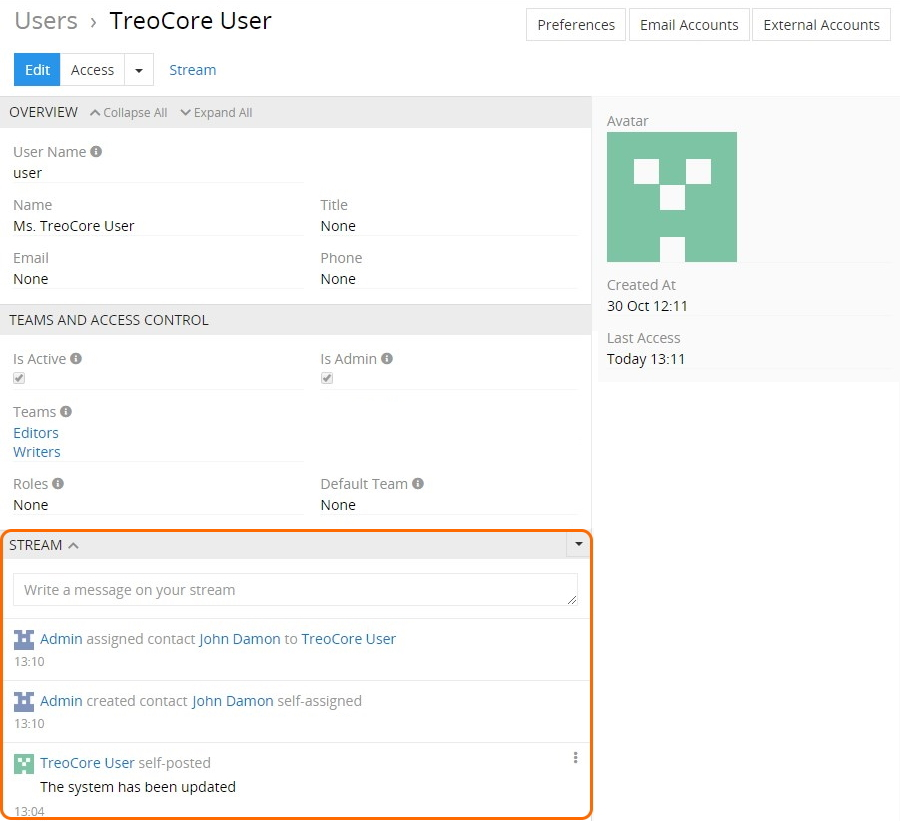

You can manage the types of activity to be displayed here in the corresponding actions menu:

Recent updates and comments about certain entity records are displayed on the activity stream panel, making it an excellent way to keep track of the changes in KennerCore. 

You can also create a post in the corresponding message box right on the `STREAM` panel:

Self-posted messages can be edited and removed via the corresponding options of the common [single-record actions](./views-and-panels-core.md#single-record-actions) menu:

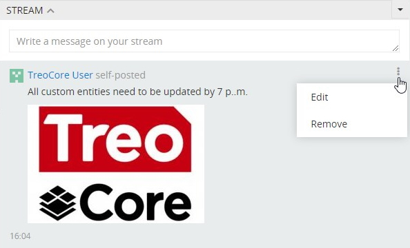

To learn more about the stream and its features, please, refer to the corresponding [article](./stream-core.md) within this user guide.

#### User Preferences

If you want to edit your user preferences, select the `Preferences` option from the user drop-down menu or use the `Preferences` button on the user profile page and make the desired changes on the "LOCALE", "MISC", "USER INTERFACE", "SMTP" panels of the current user page.

To reset preferences to default, please click the `Reset to default` button.

 

#### User Interface Settings

Select the `Custom Tab List` checkbox to enable a custom navigation menu. Using the `Add` button select the entities to be linked to your custom [navigation menu](#navigation-menu).

[Dashboard](./dashboards-and-dashlets-core.md#dashboards) layout and [dashlet](./dashboards-and-dashlets-core.md#dashlets) settings are also available for editing on the `USER INTERFACE` panel:

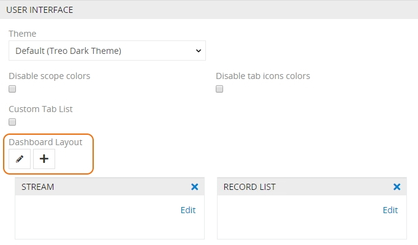

The same options are available on the KennerCore starting page:

Click the editing button and enter a name for your dashboard in the corresponding field of the "Edit dashboard" pop-up and hit `Enter`:

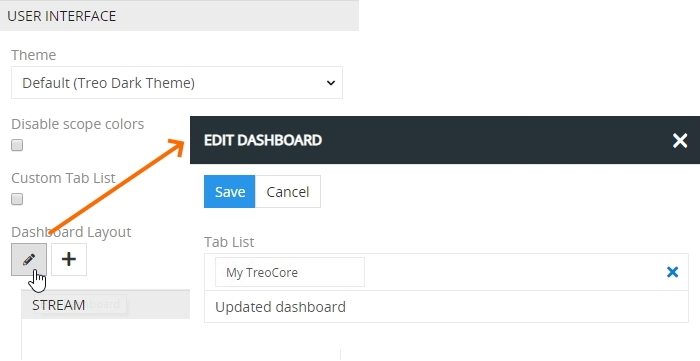

Click the `Save` button to finish creating the new dashboard. Use the same pencil button if you wish to rename or remove the existing dashboards.

Using the `+` button add as many dashlets as you need. The added dashlets can be resized using the double-headed arrow in the bottom right corner of each dashlet. Click `Edit` to modify the added dashlets, if needed.

To rearrange your dashboard view, drag-and-drop the dashlets right on the `USER INTERFACE` panel:

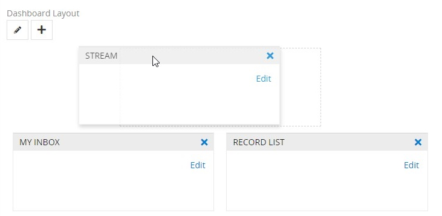

Alternatively, you can customize your [dashboard](./dashboards-and-dashlets-core.md#dashboards) view in the same way on the KennerCore starting page.

#### Email Accounts

KennerCore works with IMAP mail accounts, with or without SSL protection. KennerCore is able to send emails via SMTP Server, also with or without SSL protection, which can be enabled or not.

To open your personal email accounts, click the `Email Accounts` button on the user profile page; the list of the existing accounts, if any, will be displayed on the "Personal Email Accounts" page:

 

Each user can have one or more private email accounts that can be viewed, edited or removed right from the "Personal Email Accounts" list view page:

##### Creating

Click the `Create Email Account` button; the following creation page will open: 

Here and fill in the required fields (marked with an asterisk) and configure the IMAP, SMTP options available in accordance with your email account server.

### Last Viewed

Select the `Last Viewed` option from the user drop-down menu to see the history of your visited pages within the KennerCore system:

### Clear Local Cache

KennerCore is a single page application (SPA). To improve the page loading time, it actively uses cache for content as well as for the user interface.

If you want to be sure in getting the latest information and application functions, please use the `Clear Local Cache` option from the user drop-down menu:

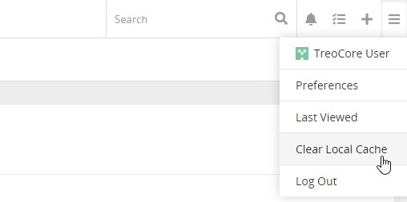

## Breadcrumb Navigation

KennerCore comes with breadcrumb navigation on each page in the system. Breadcrumb navigation is a form of a path-style clickable navigation, which links the user back to the prior website page in the overall online route. It reveals the path the user took to arrive to the given page. The `>` symbol separates out the hierarchical search order from beginning to end and may look something like:
`Home Page > Section Page > Subsection Page`.

